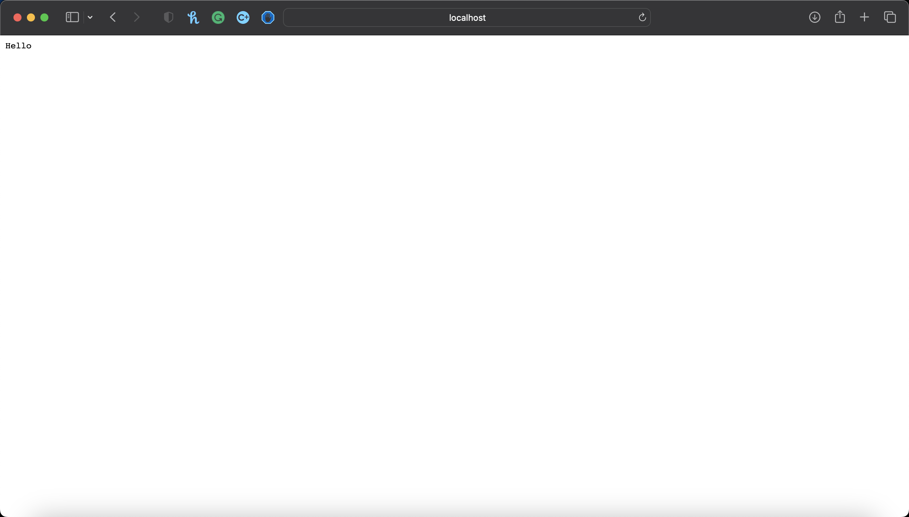
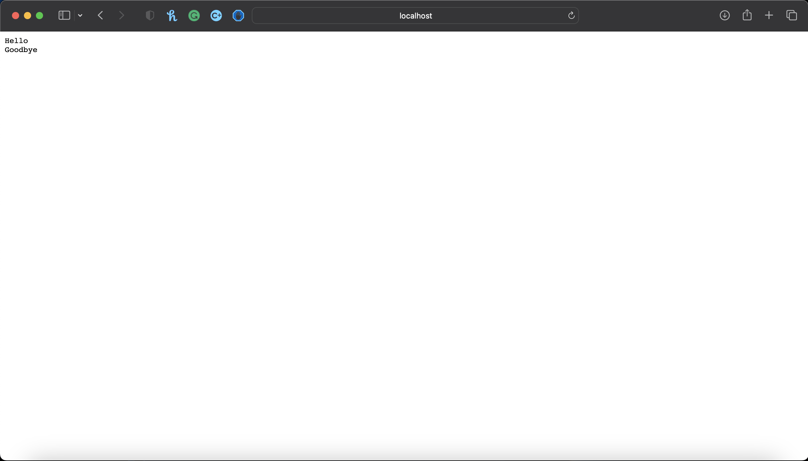
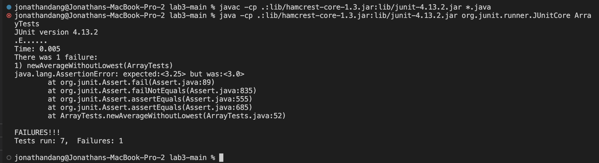
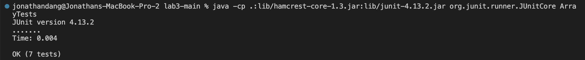

# CSE 15L WI 23 Lab Report 2

## 1. Server
StringServer.java Code:

```
public String handleRequest(URI url) {
        if(url.getPath().contains("/add-message")) {
            String[] parameters = url.getQuery().split("=");
            holder += parameters[1] + "\n";
            return holder;
        }
        else {
            return holder;
        }
    }
 ```
First Test:



Second Test:



## 2. Bugs
Original Code:
```
static double averageWithoutLowest(double[] arr) {
  if(arr.length < 2) { return 0.0; }
    double lowest = arr[0];
    for(double num: arr) {
      if(num < lowest) { lowest = num; }
    }
    double sum = 0;
    for(double num: arr) {
      if(num != lowest) { sum += num; }
    }
    return sum / (arr.length - 1);
}
```
Tests for Original Code:
```
private static final double DELTA = 1e-15;

 @Test
 public void newAverageWithoutLowest() {
   double[] arr = {1.0, 1.0, 3.5, 5.0, 3.5};
   double[] arr2 = {2.5, 1.5, 6.0, 3.5};
   assertEquals(3.25, ArrayExamples.averageWithoutLowest(arr), DELTA);
   assertEquals(4.0, ArrayExamples.averageWithoutLowest(arr2), DELTA);
 }
```
The test above would provide the following output:



A symptom from the code above would be shown when there was two numbers that were equal to one another and they were both excluded from the sum. This is shown in the first test where it would result in the test failing because the program would output the double 3.0 instead of 3.25. Both of the doubles (1.0) were exluded from the sum.

After looking further into the code, I learned any double in the array that was equal to the lowest number would be exluded, this meant that if there was two or more doubles that were equal to one another then any double within the array equal to the lowest double would be excluded from the sum. I revised the code so that the double sum would be comprised of every double and would only subtract the lowest number at the end so that it would only subtract the lowest number once.

Redone Code:

```
static double averageWithoutLowest(double[] arr) {
  if(arr.length < 2) return 0.0;
  double lowest = arr[0];
  sum = 0;
  for(double num: arr) {
    if(num < lowest) lowest = num;
    sum += num
  }
  sum -= lowest;
  return sum / (arr.length - 1);
}
```

Tests for Redone Code:



## 3. Learning

In the week 2 lab where we were asked to create a local server hosted website, it was something completely brand new to me, it was acutally not as hard as I initally thought it would be. The code was the code for the file Server.java was somewhat confusing, the NumberServer.java file was somewhat straightforward and changing the code to change the output of the website was somewhat simple as the code for the file was easy to understand. I also understand this was done on a local server so we needed to be logged into our ieng6 account and connected to the UCSD-Protected wifi in order to create the website.


