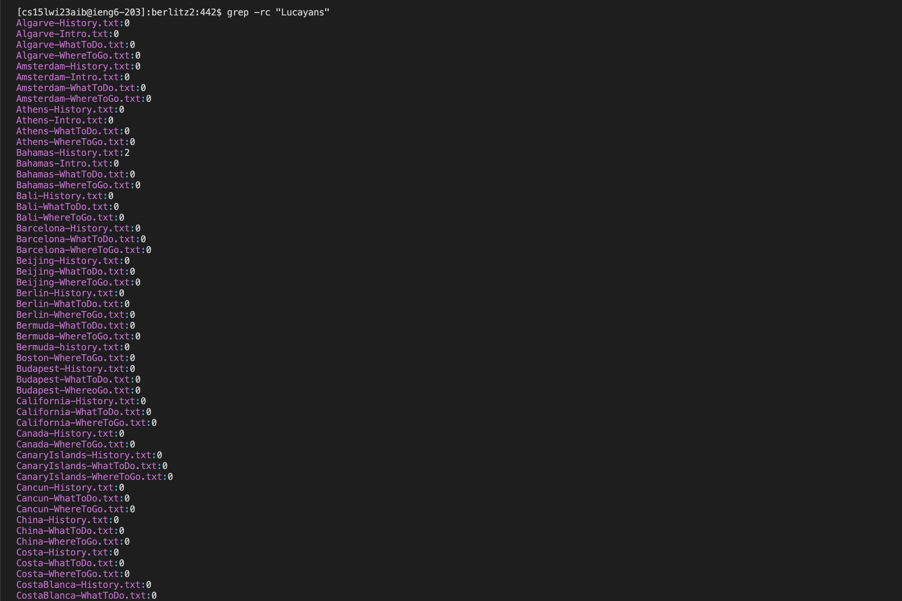
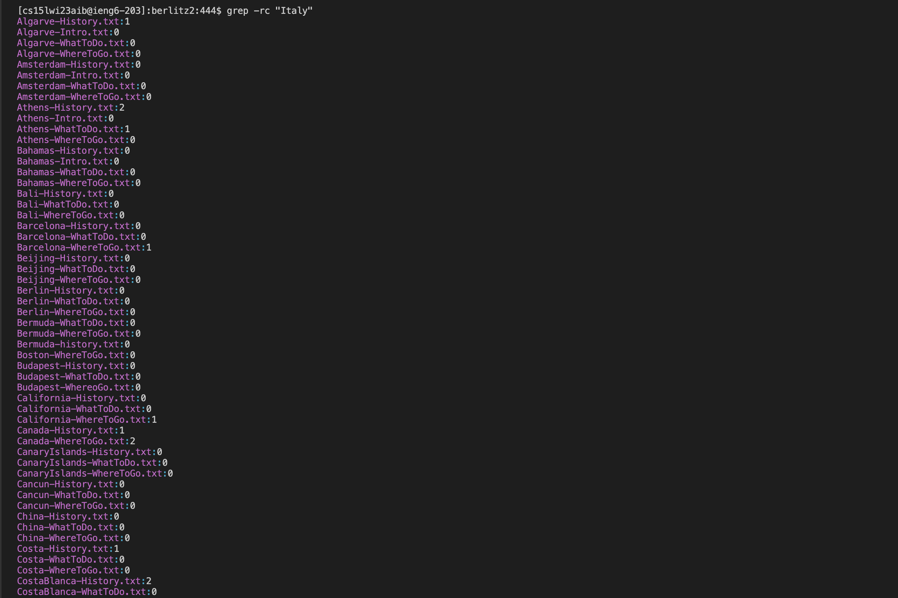

# Lab Report 3

## Grep

### L

### R

### C

When the command `grep -c` is used along with a string, it will list out how many times the string is found in the file.

Results of `grep -rc "Lucayans"`

Results of `grep -rc "Italy"`

### I

When the command `grep -i` is used alogn with a string, it will search for any string that matches regardless of capitalization.

Results of `berlitz2:449$ grep -ri "LUCAYANS" | wc`

Results of `berlitz2:450$ grep -ri "ITALY" | wc`

I found these commands through a combination of using the command `man grep` in the bash terminal, ChatGPT, and this [website](https://www.thegeekstuff.com/2009/03/15-practical-unix-grep-command-examples/).
