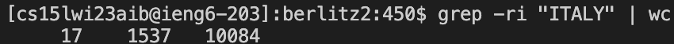

# Lab Report 3

## Grep

All commands done within this lab report are done within the working directory of:

`/home/linux/ieng6/cs15lwi23/cs15lwi23aib/skill-demo1-data/written_2/travel_guides/berlitz2`

Also note that all commands will be some type of variation of `grep -r` as we will need to recursively look for files within the directories

### O

When the command `grep -o` is used along with a string, it will return the files that contain the string along with the string that matches it

Results for `grep -ro "Lucayans"`

Results for `grep -ro "Italy"`

### N

When the command `grep -n` is used along with a string, it will list out the line that the string is found on within the file

Results of `grep -rn "Lucayans"`

Results of `grep -rn "Italy"`

### C

When the command `grep -c` is used along with a string, it will list out how many times the string is found in the file.

Results of `grep -rc "Lucayans"`

Results of `grep -rc "Italy"`

### I

When the command `grep -i` is used alogn with a string, it will search for any string that matches regardless of capitalization.

Results of `grep -ri "LUCAYANS" | wc`

Results of `grep -ri "ITALY" | wc`

I found these commands through a combination of using the command `man grep` in the bash terminal, ChatGPT, and this [website](https://www.thegeekstuff.com/2009/03/15-practical-unix-grep-command-examples/).
