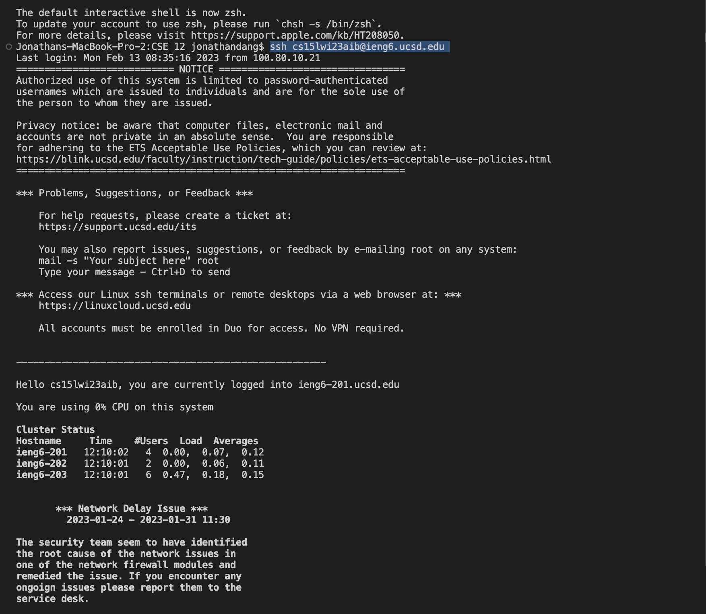
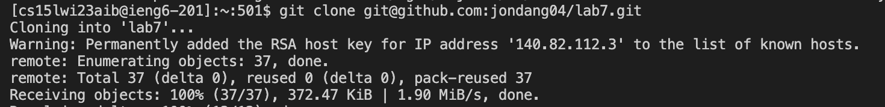
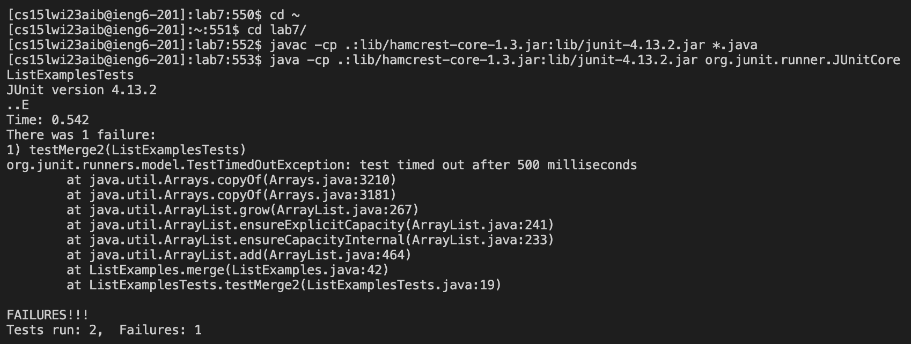
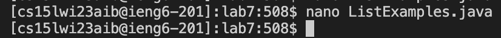
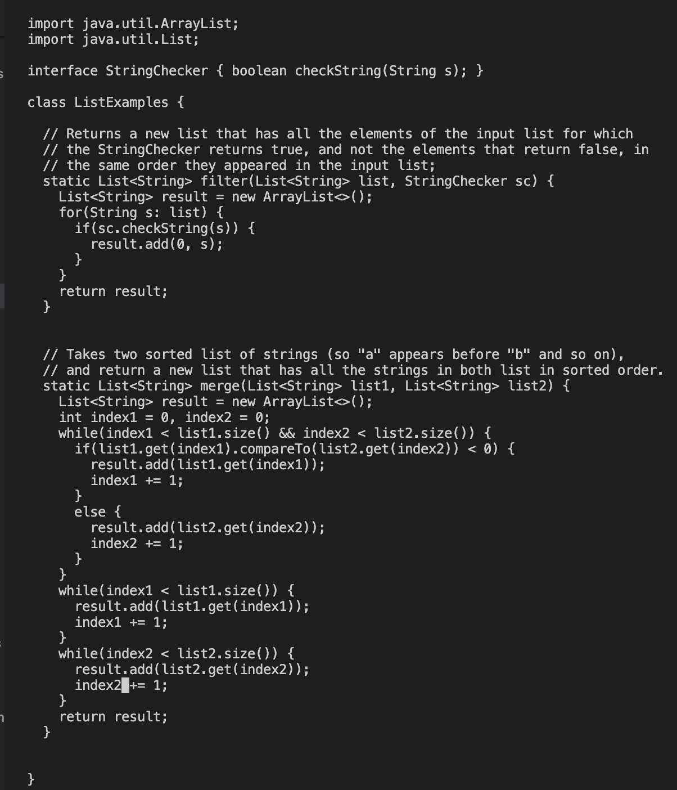
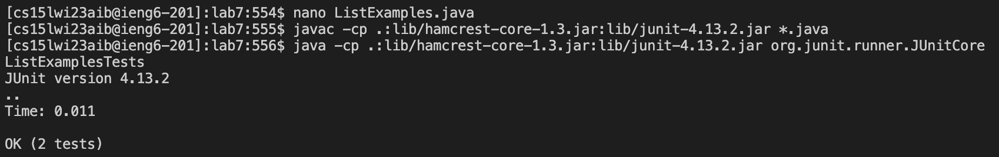
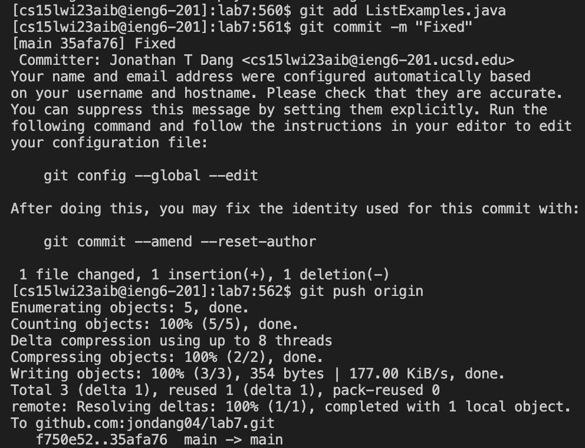

# CSE 15L WI 23 Lab Report 1

## 1. Login to ieng6

  - Type in `ssh cs15lwi23aib@ieng6.ucsd.edu` which should automatically log in without the use of a password

  

## 2. Clone the Repository

  - Type in `git clone git@github.com:jondang04/lab7.git`, using the command `^V` to past the ssh link after typing `git clone`

  

## 3. Run the Tests

  - Type in `cd l` then `<tab>` to autocomplete the directory
  - Copy and paste `javac -cp .:lib/hamcrest-core-1.3.jar:lib/junit-4.13.2.jar *.java` using `<^C>` and `<^V>`
  - Copy and paste `java -cp .:lib/hamcrest-core-1.3.jar:lib/junit-4.13.2.jar org.junit.runner.JUnitCore` using `<^C>` and `<^V>` and then type in `L` then     press `<tab>` which autocompletes it to ListExamples then type in `Tests`

  

## 4. Edit the Code
  
  - Type in `nano L` then press `<tab>` then type in `.java`
  - Press `<^W` and type in `index1 +=`
  - Then press `<down arrow>` 17 times and and `<right arrow>` 4 times
  - Press `<backspace>` then type `2`
  - Press `<^O>` then `<Enter>` and finally `<^X>` to exit

  
  
  
  
## 5. Rerun the Tests

  - Press `<up>` 3 times 
  - Press `<up>` 3 times

  

## 6. Push changes to Github

  - Type in `git add L` then press `<tab>` then type in `.java`
  - Type in `git commit -m "Fixed"`
  - Type in `git push origin`

  
